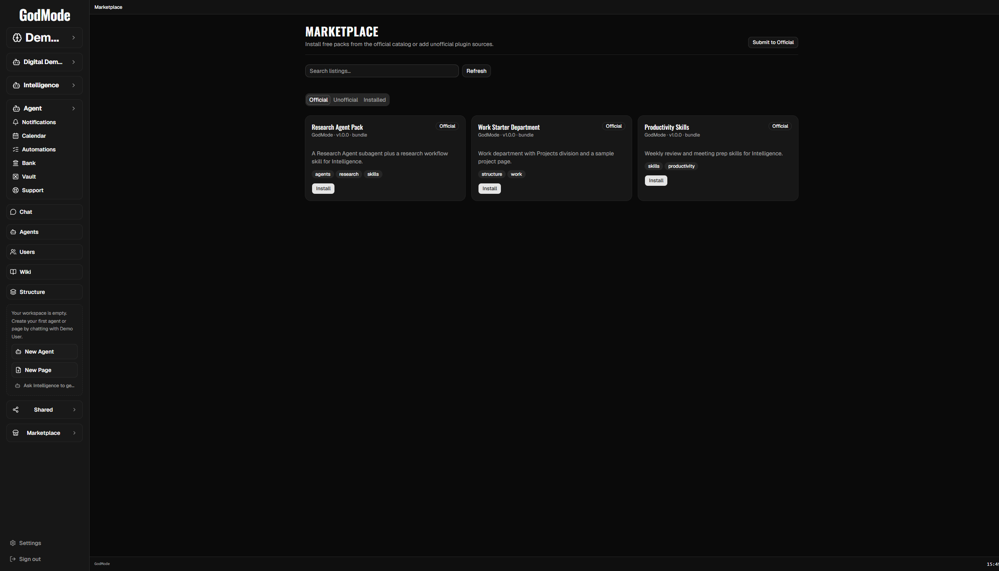

# Marketplace

GodMode Marketplace installs packs and plugins from catalogs, and (on GodMode Cloud) supports **paid Official** items and **user-to-user Community** listings with real-money checkout.

## Tabs

| Tab | Role |
|-----|------|
| **Official** | ReBotics-curated catalog only (free + paid). Paid revenue is **100%** to the platform. Not a public seller path. |
| **Local** | Self-host and hub only: local plugin folders and third-party catalog URLs (typically free). Hidden on GodMode Cloud. HTTP paths remain `/marketplace/catalog/unofficial` on those hosts. |
| **Community** | Buyer shelf: catalog plugins plus public listings. Checkout always uses `listingId`. |
| **Installed** | Workspace plugins + install history (buyer). |
| **Sell** | Seller dashboard: ToS, payouts, publish wizard, My listings (including catalog plugins). |

## Product rules

- **One seller path** — public sellers use **Community**. Official is ReBotics-only.
- **One listing record** — every Community item (plugin, clone pack, live share, inference) has a `marketplace_listings` row. Catalog JSON is the plugin install artifact attached via `catalog_entry_id` / `listingId`.
- **No credits** — purchases are USD (or crypto) via Stripe, PayPal, or MetaMask-compatible checkout.
- **Official items** — merchant of record is ReBotics/GodMode; **100%** of Official revenue to the platform.
- **Community (user) listings** — sellers connect Stripe Connect, PayPal, and/or MetaMask; platform takes **10%**.
- **ToS** — see [MARKETPLACE_TOS.md](MARKETPLACE_TOS.md). Chargeback ⇒ permanent Marketplace ban (no buy, no earn).
- **Surfaces:** Official and Community catalogs are the same GitHub indexes on Local, Hub, and Cloud. SaaS is the paid checkout authority. Local and private-hub installs pull those catalogs (plus Cloud public listing metadata) and install plugins on this instance. Paid Local Buy starts Cloud Stripe Checkout and returns to this Bridge with `session_id`. Live share stays same-host only.

## Official catalog

Default Official index (every surface):

- `https://raw.githubusercontent.com/ReBoticsAI/GodMode-Marketplace/main/catalog/official/index.json`
- Legacy alias (synced): `.../catalog/index.json`
- Override with `MARKETPLACE_OFFICIAL_URL`
- Catalog-author file override: `MARKETPLACE_LOCAL_CATALOG_PATH` (no sibling auto-detect)

Community gated index (every surface):

- `https://raw.githubusercontent.com/ReBoticsAI/GodMode-Marketplace/main/catalog/community/index.json`
- Override with `MARKETPLACE_COMMUNITY_URL`
- Catalog-author file override: `MARKETPLACE_LOCAL_COMMUNITY_CATALOG_PATH` (no sibling auto-detect)
- Bridge: `GET /api/marketplace/catalog/community`
- Cloud overlay for listing ids and public clone/live cards: `GET /api/marketplace/commerce/catalog/community/public`

On **GodMode Cloud** (`INSTALLATION_SURFACE=saas`), Official entries are curated in `marketplace_official_catalog` (admin API) and served at:

- Authenticated: `GET /api/marketplace/catalog/official`
- Public (local/private-hub pulls): `GET /api/marketplace/commerce/catalog/official/public`

Point non-SaaS installs at the public URL with `MARKETPLACE_SAAS_OFFICIAL_URL` (defaults to the Cloud Official public feed) so they see ReBotics-selected prices. The same default applies to `MARKETPLACE_SAAS_COMMUNITY_URL` for Community listing ids and public clone/live cards. Set either variable to empty to disable that Cloud overlay.

Open **Marketplace → Official** to browse. Free entries install immediately. Paid entries require checkout (card / PayPal / crypto), then **Install if owned**.

Official **connectors** (Vault Connect account links and Official Marketplace
plugins that talk to external hosts) must meet the written quality bar in
[OFFICIAL_CONNECTORS.md](OFFICIAL_CONNECTORS.md): auth, refresh, scopes, webhooks,
rate limits / failure UX, teardown, capability grants, Cloud pins, and docs.
GitHub (Vault Connect + Official `godmode-plugin-github`) is the reference that
meets the bar on Cloud.

### Seller intake verify (Community)

Public **Community** catalog PRs for `installType: "plugin"` require a public
`pluginRepo`, an immutable `pluginRef` (tag or commit), and a green reusable
GitHub Actions verify run (`ciRunUrl`). Sellers copy
`examples/seller-plugin-verify.yml` from
[GodMode-Marketplace](https://github.com/ReBoticsAI/GodMode-Marketplace)
and call
`.github/workflows/reusable-plugin-verify.yml`. Add entries to
`catalog/community/index.json` (not Official). Catalog validate rejects
floating refs; set `MARKETPLACE_REQUIRE_PLUGIN_CI=1` for fail-closed
`ciRunUrl` checks. See Marketplace CONTRIBUTING for the seller checklist.

### Official Verified badge

Official is ReBotics-curated and does **not** require Verified badges. Cards only
show Verified when `verifiedPublisher` is explicitly true. Community seller
trust uses seller-account earned tiers and admin freeze/floor (#311, #313), not Official defaults.

### Community verified seller (#311 / #313)

Community (user) sellers earn **Verified** badges from the count of **gate-passing**
Community listings: `seller_kind=user`, `status=active`, `visibility=public`. Catalog
intake CI (GodMode-Marketplace verify workflow + Community index gate) is what gets a
plugin onto that shelf; Bridge does not re-run Actions. It counts live public listings.

| Tier | Gate-passing listings |
|------|------------------------|
| none | 0–2 |
| Verified I | 3–4 |
| Verified II | 5–9 |
| Verified III | 10+ |

Public Community browse returns `verified_tier` (0–3) and keeps `verified_publisher`
as `1` when tier is greater than 0. Community cards show the matching badge.

Admin escape hatches on `marketplace_seller_accounts`:

- `verified_seller=1` floors the seller at Verified I (and clears freeze). Admin →
  Marketplace, or `POST /api/admin/marketplace/sellers/verified`.
- `verified_frozen=1` hides the badge even when the earned count qualifies.
  `POST /api/admin/marketplace/sellers/frozen` with `verifiedFrozen`.

Official cards do **not** use this seller-tier system.

### Buyer install pins (#177)

Official and Community **plugin** installs fail closed unless the catalog entry
sets an immutable `pluginRef` (release tag or commit sha). Optional
`pluginDigest` (commit sha) must match `git rev-parse HEAD` after checkout.
Floating refs (`main` / `master`) are rejected for those catalogs. Local folder
registration (self-host / Unofficial) stays operator-trusted and does not use
this pin gate.

### Cloud Official pin ops (#292)

On GodMode Cloud, curated Official rows live in `marketplace_official_catalog`
and are served at the public Official feed. Active `installType: "plugin"` rows
must have an immutable `pluginRef` (and preferably `pluginDigest`). Admin upsert
fail-closes on floating refs. Admin checklist:

1. `GET /api/marketplace/commerce/admin/official-catalog` and check `pinAudit`
   (empty means all active plugins are pinned).
2. Prefer `POST /api/marketplace/commerce/admin/official-catalog/sync-from-public`
   to import pinned plugin/pack rows from the free Official index while keeping
   existing Cloud `price_cents` / `listing_id` / `sort_order`.
3. Or upsert each plugin with `pluginRef` (tag or commit) and optional
   `pluginDigest` via `POST .../admin/official-catalog`.
4. Smoke: install a free Official plugin on Cloud; confirm checkout uses the pin
   (no floating `main`).
5. After a new plugin release, bump the catalog pin (tag/sha + digest) before
   promoting the row to `active`.

Intake CI does not replace install pins or runtime least privilege.
Runtime capability allowlists (#290 network, #303 tools/records): Official/Community
installs are **deny-by-default** for network, tools, and records. Catalog fields
(`networkHosts`, `toolNames`, `recordNames`) and/or manifest
`capabilities.{network,tools,records}` are granted at install into
`godmode.capabilities.json`. Plugins must use `host.externalFetch` for outbound
http(s), and may only register/call tools and ObjectTypes named in the grant.
Manifest `objectTypes` names are also collected into the records grant. Local
folder / operator path installs stay unrestricted. Last-tenant uninstall revokes
the grants file; kill switches (#96) remain the emergency stop.

## Community (user-to-user)

Every Community sale is a listing (`seller_kind=user`). Catalog PRs are the public artifact transport. They do not replace the listing.

1. Seller: **Sell** → accept ToS → connect payout (required for paid) → **Submit to Community catalog** (opens GodMode-Marketplace PR from GodMode) or claim after an external PR → publish listing price.
2. **Plugins:** PR into GodMode-Marketplace `catalog/community/index.json` (`installType: "plugin"`, CI + `pluginRef`). Use Sell → **Submit to Community catalog** or open a PR manually. Claim on Sell (GitHub Connect must match catalog author or `pluginRepo` owner). Paid checkout uses `listingId` and Stripe Connect (10% / 90%).
3. **Clone packs** (skill, agent, page, workflow, bundle): same Community index with `installType: "clone"`, `bundlePath`, and a pinned GitHub repo (`pluginRepo` + `pluginRef`). Buyer installs a copy from that pin (Official packs already work this way). Not a plugin runtime. Catalog-backed packs skip admin blob review. Private work stays on Marketplace → Local, a private repo, or Live Share / Federation.
4. **Live share:** paid Shared grant on this host (`share_grant` + entitlement). Same machine or GodMode Cloud tenants on the VPS. Not a copy, and not a home GPU.
5. **Inference:** metered access to a seller `inference_endpoints` row on **that Bridge**. Hidden and blocked on GodMode Cloud. Friend-to-friend free model share under AI settings is not Marketplace.
6. Buyer: **Community** → catalog plugins and packs, plus live listings → free install, or paid Stripe checkout then install. Local Buy does not need a GodMode Cloud account. Recovery of a purchase on a new machine (email / Stripe customer / paste `cs_` session) is a follow-up.

Guest checkout return URLs may be `http://127.0.0.1` / `localhost` or `https://*.godmode.software`, and success URLs must include `{CHECKOUT_SESSION_ID}`.

Public browse listings: `GET /api/marketplace/listings?seller_kind=user` (status=active, visibility=public, excluding catalog-backed copies). Community catalog: `GET /api/marketplace/catalog/community` (entries include `listingId` when claimed).

Attaching a home llama-server to Cloud Intelligence is not Marketplace. That follow-up is #576.

## Seller payouts (Stripe Connect)

Community sellers onboard with **Stripe Connect Express Account Links** from
Vault → Marketplace (Marketplace → Sell links there)
(#316, #329). GodMode Cloud (or the hub commerce authority) creates/reuses a
Connect account and redirects to Stripe. Return/refresh URLs land back on the
page you started from: `/vault?tab=integrations` or `/marketplace?tab=seller`.

Requires `STRIPE_SECRET_KEY` (same secret used for Marketplace Checkout). Set
`WEB_PUBLIC_URL` / `WEB_ORIGIN` so return URLs match the UI origin. Local/hub
Sell UIs still proxy commerce actions to Cloud.

Paste `acct_…` remains an advanced fallback only. PayPal and crypto seller rails
are deferred (#317).

Durable buy/sell uses ObjectTypes (see [OBJECTTYPE_KERNEL.md](OBJECTTYPE_KERNEL.md)):

| ObjectType | Actions |
|---|---|
| `MarketplaceListing` | `publish`, `acquire`, `archive`, … (`price_cents`) |
| `MarketplaceOrder` | `start_checkout`, `capture_paypal`, `confirm_crypto` |
| `MarketplaceSellerAccount` | `accept_tos`, `connect_payout`, `commerce_config` |
| `CatalogInstall` | `install_entry` (gates paid Official entries) |

Payment provider webhooks and the public Official JSON feed are **protocol exceptions**, not parallel Express CRUD.

## Sell tab

**Marketplace → Sell** is the seller dashboard: ToS, Stripe Connect (Vault is the
connect home), kind-specific publish (plugin, clone, live, inference), and **My listings**
(draft, in review, listed, archived). Catalog plugins appear here once claimed.

Admin → Marketplace has the review queue for non-plugin listings.

## Local catalogs

**Marketplace → Local** is for free local folders, `file://` catalogs, and third-party indexes on self-host and hub installs (same schema as Official, typically `priceCents: 0`). It is not the Community user-listing feed. GodMode Cloud hides this tab: folder registration is blocked there, and Official plus Community are the install paths. Intelligence can still scaffold and install a plugin in the workspace coding root.

## Related

- [MARKETPLACE_TOS.md](MARKETPLACE_TOS.md)
- [CONFIGURATION.md](CONFIGURATION.md)
- [PLUGIN_AUTHORING.md](PLUGIN_AUTHORING.md)
