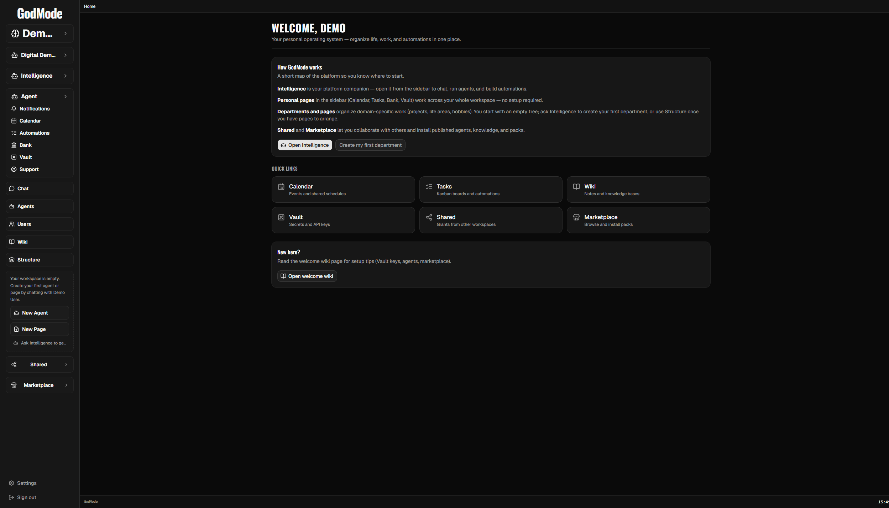

# Onboarding

Each **workspace (tenant)** runs the **FirstRunWizard** on first use until that workspace marks an LLM as ready (or you choose the cloud/Vault path). Completing onboarding for one account does **not** dismiss it for others. That matters for multi-user hubs.



## When the wizard shows

The web client calls `GET /api/onboarding/status` after the user is authenticated and past SaaS gates (email verified; platform admins also need MFA). The wizard opens when both `completed` and `llmReady` are false for the **active tenant**.

On SaaS, unverified users cannot call product APIs (`403 EMAIL_NOT_VERIFIED`). The client waits until email verification succeeds, then re-checks status. A hard refresh after verify also re-runs the gate.

Flags live in the tenant SQLite `ai_settings` table (`onboarding.completed`, `onboarding.llm_ready`). Browser `localStorage` is updated when the wizard finishes but is **not** the source of truth for showing it.

On multi-tenant hubs, a process-wide `CURSOR_API_KEY` does **not** mark every workspace `llmReady`. Only a Platform Vault Cursor key (or an explicit `onboarding.llm_ready` flag) does.

## Steps

### Self-host / desktop / private hub

1. **Welcome**: overview of Intelligence and workspace areas.
2. **Choose your LLM**: llama.cpp is the primary local stack (pick a GGUF model when present). Ollama and LM Studio are additional options. Open Vault → Inference for cloud keys, or continue after starting a local model.
3. **Connect Exa (optional)**: explain web search / fetch for agents; Open Vault → Inference → Search. Continue without requiring Exa.
4. **Ready**: Get started opens Chat (Intelligence panel) and Marketplace starter packs remain available anytime.

### GodMode Cloud (`INSTALLATION_SURFACE=saas`)

1. **Welcome**: same overview.
2. **Connect your LLM**: explain subscription (use your plan, for example Cursor) vs metered Platform API keys. Status badge; Continue gated on `llmReady`. Open Vault → `/vault?tab=inference`. Skip for now remains available.
3. **Connect Exa (optional)**: explain Exa for agent web_search / fetch_url; Open Vault → `/vault?tab=search`. Continue without requiring Exa; optional Connected badge when `exa_api_key` is present.
4. **Ready**: Get started runs `completeOnboarding`, navigates Home, and opens the Intelligence chat panel.

Soft-dismiss (Open Vault) pauses the wizard so Vault is usable. Leaving Vault while onboarding is incomplete brings the wizard back and refreshes LLM / Exa status so badges are not stale.

Full Vault Connect cards stay in Vault (not embedded in the wizard). Vault hub IA and further connect migrations are tracked separately.

## Backend

- `GET /api/onboarding/status`: `{ completed, llmReady, llmStatus, cursorConnected }` for the active workspace
- `GET /api/onboarding/detect`: local models + Ollama probe (self-host; unused on Cloud UI path)
- ObjectType actions on `TenantOnboardingConfig`: `mark_llm_ready`, `complete`

Local single-user installs that previously stored flags in `platform_meta` are migrated once into the active tenant DB. **Hub mode never migrates** platform flags so every new workspace gets the wizard.

## Reset wizard for a workspace (ops)

Without deleting the account, clear tenant settings (SQL against that tenant DB):

```sql
DELETE FROM ai_settings WHERE key IN ('onboarding.completed', 'onboarding.llm_ready');
```

Then hard-refresh the app while signed into that workspace. If the tenant already stored a Vault Cursor key, remove or leave it: Vault keys still count as `llmReady` on hubs.

## Models directory

Place `.gguf` files in directories listed by `LLAMA_MODEL_DIRS` (semicolon-separated on Windows). Defaults include `~/llama.cpp/models` and `~/Downloads`.

For a tested Gemma 4 26B + 16 GB GPU profile, Docker hub + host `llama-server`, and `LLAMA_EXTERNAL` attach mode, see [LOCAL_LLM.md](./LOCAL_LLM.md).

## Optional Tailscale

After LLM setup, enable federation under **Shared → Network** if you plan to share across homes. See [SHARED_FEDERATION.md](./SHARED_FEDERATION.md).

Full walkthrough: [VERIFICATION.md](./VERIFICATION.md)
