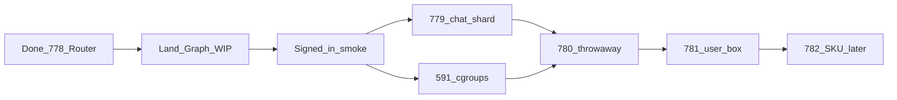

# Local roadmap: Graph-first isolation

Working order for Graph WIP and the Cloud isolation ladder. Epic
[#777](https://github.com/ReBoticsAI/GodMode/issues/777) stays the public spine.
This file is the near-term sequence; it does not replace the GitHub Project board.

## Where we are

| Item | Status |
|------|--------|
| Data Router Phase 1 (#778) | Shipped on `main` |
| Windows `npm run dev` (#786), native ensure (#787) | On `main` |
| Graph WIP | Draft PR [#788](https://github.com/ReBoticsAI/GodMode/pull/788); pre-auth Graph at `:5173` |
| Heart → Hub / You copy + DATA_ISOLATION Graph section | On branch / PR #788 |
| Truth snapshot | [STATE_GRAPH_ISOLATION.md](./STATE_GRAPH_ISOLATION.md) |
| #172 design GO for #780 | Closed |
| Cloud/local signed-in chat digest smoke | Still needs a signed-in session |
| #779–#782, #591 | Open; no phase reorder |

## Working order

### Now

1. Review / land Graph draft PR [#788](https://github.com/ReBoticsAI/GodMode/pull/788) when ready (merge only with explicit go-ahead).
2. **Local signed-in smoke**: You / Hub / Intelligence Chat through Data Router digests (`DATA_ROUTER_CHAT_READS` on). Cloud smoke after SaaS pin when ready.

### Next code (isolation, Graph-aligned)

3. **[#779](https://github.com/ReBoticsAI/GodMode/issues/779) chat-first shard** under SQLite-universe `chats/` + Data Router mounts. Graph Chat bubbles are the UX face; Router remains the storage door. Prefer this before #780.
4. **Parallel:** [#591](https://github.com/ReBoticsAI/GodMode/issues/591) cgroups (prefer-before-#780 noisy neighbor).
5. **[#780](https://github.com/ReBoticsAI/GodMode/issues/780)** disposable job throwaway (strong container interim OK per #172).
6. **[#781](https://github.com/ReBoticsAI/GodMode/issues/781)** per-user runtime box wraps the Graph instance (You/Hub/Workspaces/agents inherit the box).
7. **[#782](https://github.com/ReBoticsAI/GodMode/issues/782)** dedicated VPS SKU last.

## Non-goals

- Do not block Graph on #781.
- Do not skip Data Router / #779 because “the Graph is the architecture.”
- Do not full `heart/` → `hub/` on-disk migration yet (alias only).
- Do not rename Intelligence vs Agents or change SaaS `deploymentMode: hub`.
- This file is local working order; updating the Project board is a separate step.

## Layer cheat sheet

| Layer | Job |
|-------|-----|
| Graph | Map users own (You, Hub, Workspaces, …) |
| SQLite universe + Data Router | Storage execution |
| Per-user box + job throwaway | Hard compute boundary |

## Related

- [DATA_ISOLATION.md](./DATA_ISOLATION.md)
- [STATE_GRAPH_ISOLATION.md](./STATE_GRAPH_ISOLATION.md)
- [SQLITE_UNIVERSE.md](./SQLITE_UNIVERSE.md)
- [GRAPH_MISSIONS.md](./GRAPH_MISSIONS.md)
