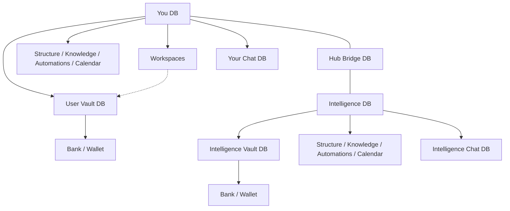

# SQLite universe

Target architecture: every durable actor and surface is its own SQLite file. The Graph is the living map of **You** (objectType `User`) in a GodMode instance. ObjectTypes remain the entity contract; adapters resolve to the correct file. Windows open from node metadata recipes.

This is the **target**. Migration from today’s Cloud / Users / User / Workspace planes is phased (see below). Until a plane is migrated, Bridge continues to use the legacy paths documented in [multi-tenant-model.md](./multi-tenant-model.md).

## Product topology



| Role | Meaning |
|------|---------|
| **You** | Graph root (objectType `User`). Own SQLite. Owns User Vault, Workspaces, owner surfaces, and personal Chat. |
| **Intelligence** | Platform agent under You. Own SQLite. Owns Intelligence Vault, owner surfaces, Chat, and Hub link. |
| **Workspaces** | Hub child on The Graph (not under Vault, not chained under Marketplace). Catalog exemplars: Personal, Project Alpha, and Family with Agents, Structure, and Chat. Many workspaces may read approved secrets from User Vault. |
| **Hub** | Bridge, right of the You↔Intelligence spine. Ops/logs SQLite only. Does not store user chat bodies. On-disk path remains `heart/` until a dual-read migration to `hub/`. |
| **Vaults** | User Vault (secrets, Bank → Wallet; LLM key storage) and Intelligence Vault (Bank → Wallet). Account / Cloud / LLM purpose live on You's Information panel. |
| **Owner surfaces** | Structure, Knowledge, Automations, and Calendar hang directly off You or each agent on The Graph (no Life hub). Chat stays outside these trees. |
| **Agents (specialized)** | Under Workspaces on The Graph (not on the spine). Intelligence remains the platform agent; Digital You is You's Chat bubble. |

**Unlock hubs are not on The Graph.** Chat window chrome is open by default. Unlock commerce ObjectTypes are retired in a dedicated phase.

## File layout (target under `PLATFORM_DATA_DIR`)

| File role | Path | Owns |
|-----------|------|------|
| Registry | `registry.sqlite` | Path index, owners, kinds, graph WindowSpec (no message bodies) |
| You (User) | `actors/users/<userId>.sqlite` | User metadata, child links |
| Intelligence / Agent | `actors/agents/<agentId>.sqlite` | Agent config, child agent ids, chat thread ids |
| Chat thread | `chats/<chatId>.sqlite` | One thread’s messages/parts |
| User Vault | `vaults/users/<userId>.sqlite` | Secrets, Account/Cloud/Workspace refs, Bank |
| Agent Vault | `vaults/agents/<agentId>.sqlite` | Approved secrets + Bank for that agent |
| Hub | `heart/bridge.sqlite` | Bridge ops/logs (path alias; product name Hub) |
| Surfaces | `surfaces/<kind>/<id>.sqlite` | Structure / Knowledge / Automations / Calendar SoR |

Plugin private DBs remain under `plugin-data/` until aligned.

## Rules

1. **Owner metadata lists children.** Intelligence’s DB records which chat files it owns.
2. **Vault approval** lists which keys a chat/agent may use.
3. **The Graph** paints from catalog + registry (+ optional enrichment). It does not open every entity file to draw.
4. **Open set.** Requests declare which DB paths they need. Bridge opens only that set (caps + path jail).
5. **Dual-write** on create/delete (child file + parent metadata). GC unrefeenced files.
6. **Tools.** Agents and You get first-class allowlisted SQLite tools (`list` / `query` / `open` within jail).

## WindowSpec

Each Graph node may declare:

```ts
windows: Array<{
  kind: "chat" | "information" | "canvas" | string;
  width?: number;
  height?: number;
  placement?: "left" | "right" | "center";
  agentId?: string;
  title?: string;
}>
```

Default for You / Intelligence / Agent: Chat + Information. Client host: `FloatingWindow` chrome; body by kind. Open Canvases feed Chat “Select a page” / context.

## ObjectTypes

ObjectTypes name entities (Agent, ChatSession, …) and drive CRUD/actions. They are **not** the window manager and **not** one ObjectType row per open floating window. Adapters map Records to the correct SQLite file once that entity’s plane is migrated. Graph copy uses **You**; the objectType / API id remains `User`.

## Open-set API (target)

```http
POST /api/sqlite-universe/open
{ "paths": ["actors/agents/intelligence.sqlite", "chats/<id>.sqlite"] }
```

Bridge validates caller ACL, resolves paths under data root, opens handles into a request-scoped set, returns handles or a session token. Hard cap on paths per request.

## Phased migration

| Phase | Deliverable | Status |
|-------|-------------|--------|
| 0 | This doc + epic tree | Done |
| 1 | Graph catalog topology + WindowSpec + open chrome | Done (catalog v2; FloatingWindow host) |
| 2 | `registry.sqlite` + open-set API + path jail | Done (`/api/sqlite-universe`) |
| 3 | Pilot: new chats/agents as own files + dual-write | Done (create paths + pilot routes) |
| 4 | Vaults absorb Account/Cloud/Workspace/Bank on Graph and storage | Done (Graph children + vault schema) |
| 5 | Unlock product retirement | Done (`UNLOCK_PRODUCT_RETIRED`; chrome always open) |
| 6 | Surface DB split + SQLite tools + manifest backup | Done (stubs + `list_sqlite_universe` / `query_sqlite_universe`) |

Legacy Cloud / Users / User / Workspace tenant files remain the SoR for most product data until per-entity cutovers finish. New dual-write files land under `PLATFORM_DATA_DIR/sqlite-universe/`.

## Related

- [architecture.md](./architecture.md) (layer overview; points here for storage target)
- [multi-tenant-model.md](./multi-tenant-model.md) (legacy planes until migrated)
- [OBJECTTYPE_KERNEL.md](./OBJECTTYPE_KERNEL.md) (The Graph + ObjectTypes)
- [ONBOARDING.md](./ONBOARDING.md) (first land on The Graph)
- [GRAPH_MISSIONS.md](./GRAPH_MISSIONS.md) (attention dots, points, Cloud leaderboard)
- [DATA_ISOLATION.md](./DATA_ISOLATION.md) (Graph map + Data Router + per-user box)
