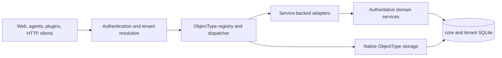
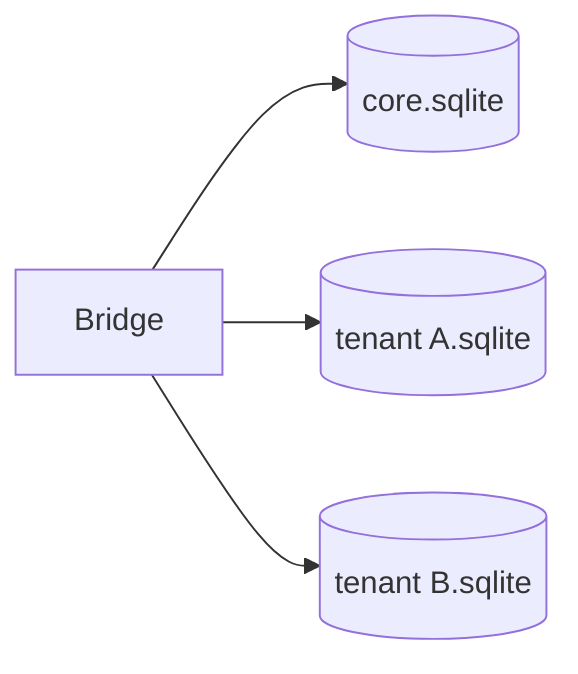
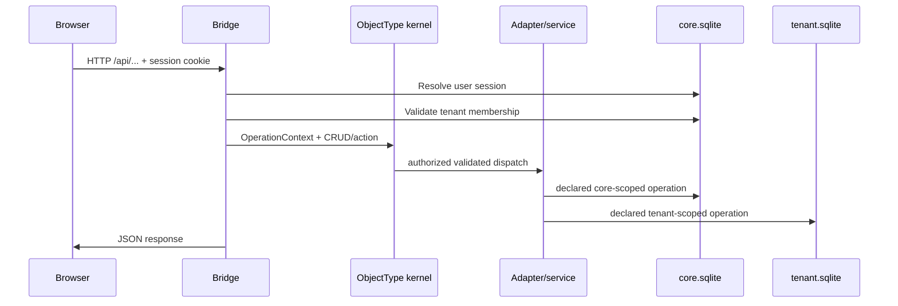
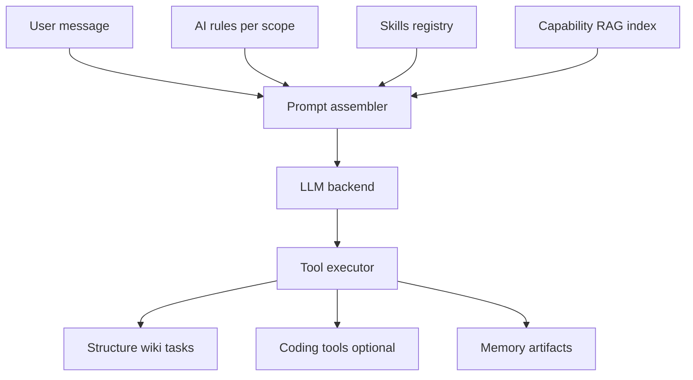

# Architecture

GodMode is a **local-first personal OS**: a React dashboard talks to a Node.js Bridge, which owns SQLite databases and orchestrates Intelligence, structure, agents, and optional plugins.

## Layer overview

| Layer | Technology | Role |
|-------|------------|------|
| Web dashboard | React + Vite | Control plane UI — Intelligence, structure, wiki, tasks |
| Bridge | Node.js + Express + SQLite | REST/WebSocket API, auth, tenant routing, AI orchestration |
| Connector | Node.js (optional) | Local runtime for hardware-bound marketplace plugins |
| Plugins | npm packages / marketplace installs | Domain extensions registered at Bridge and Web boot |
| Kernel | `@godmode/kernel` + Bridge `kernel/` | Metadata ObjectTypes → storage adapters / native tables → Record CRUD tools + UI |

## ObjectType kernel

GodMode extends in-place via **ObjectTypes** (not DocTypes). The production
registration audit discovers 74 ObjectTypes, including `StructureNode`,
`Release`, and `InstallationUpdateState`.

Core and plugin definitions declare fields, policies, explicit CRUD operations,
and named actions. The Bridge validates and registers them, then binds either an
adapter or additive native storage. Metadata drives generic Record routes,
generated AI tools, capability discovery, and web list/form pages.

Service-backed adapters preserve existing business rules and side effects.
The strict coverage and direct-write audits report zero legacy routes, legacy
callers, unmatched mutation callers, direct entry-point writes, or
static/generated tool collisions. Five domain routes remain as verified kernel
delegates. Exact parity tests require every declared core CRUD operation and
action to have a production adapter handler.

Durable async actions run through tenant-aware workers with leases, retries,
timeouts, cancellation, scoped idempotency, and replay-safe restart recovery.
Declared events use leases and per-consumer durable receipts. Live chat
WebSocket/token streaming and DM binary transfer remain specialized protocols;
their durable effects are kernel-visible, but bytes and streams are not Records.

See [OBJECTTYPE_KERNEL.md](OBJECTTYPE_KERNEL.md) for the complete action,
security, tenancy, storage, and compatibility contract.

## Data storage

### Core database (`core.sqlite`)

Global platform state:

- **Users and sessions** — email/password auth, session cookies
- **Tenants and memberships** — workspaces and roles
- **Marketplace** — Official/Local catalogs, Community user listings, paid commerce on SaaS (Stripe/PayPal/crypto), seller payouts
- **Share grants** — cross-tenant resource sharing
- **Bridge connections** — federation between Bridge instances

### Per-tenant database (`tenants/<id>.sqlite`)

One SQLite file per workspace:

- **Structure** — departments, divisions, pages
- **Intelligence** — agents, chats, messages, memories, artifacts, rules, skills
- **Productivity** — wiki, kanban cards, calendar, vault secrets
- **Automations** — workflows, hooks, schedules

Physical file separation provides tenant isolation; most tenant tables omit a redundant `tenant_id` column.

## Request flow

Every kernel request carries an `OperationContext` derived from authenticated
user, tenant, role, source, confirmation, request/idempotency keys, version, and
installed-plugin context. Handlers use `getReqTenantDb(req)` — never a global
operator database for tenant-scoped data.

Cross-database workflows do not claim atomicity across SQLite files.
Marketplace clone acquisition and plugin lifecycle use durable, idempotent saga
steps with core/tenant audit and outbox state so interruption can resume safely.
Shared-resource adapters resolve the exact active grant and owner database:
viewers read, editors mutate the owner's record, and invalid or guessed access
fails closed.

WebSocket clients pass `?tenantId=` because browsers cannot set custom headers on the upgrade.

## Intelligence pipeline

Intelligence assembles context from structure scope, rules, skills, retrieved capabilities, **memory/wiki RAG** (when enabled), and a **model harness profile**, then calls an LLM backend. Tool calls mutate tenant state through a confirm/auto policy.

### LLM backends

| Backend | How it runs |
|---------|-------------|
| **`local`** | Bridge-spawned `llama-server`, or **`LLAMA_EXTERNAL`** attach to a host process ([LOCAL_LLM.md](LOCAL_LLM.md)) |
| **`cursor_cloud`** | Cursor subscription via `@cursor/sdk` + GodMode custom tools ([CURSOR_SUBSCRIPTION.md](CURSOR_SUBSCRIPTION.md)) |
| **`provider`** | OpenAI / Anthropic (etc.) via Vault API keys |
| **`remote`** | Shared marketplace inference endpoint |
| **`cursor`** | CLI contractor (`cursor-agent`) — separate from subscription Intelligence |

Selecting a model in the Intelligence picker resolves a **harness profile** (sampling, tool mode, discovery middleware). See [LOCAL_LLM.md](LOCAL_LLM.md#model-harness-profiles-picker-driven).

### Agent memory

Working chat history, semantic `ai_memories` (hybrid RAG), episodic distill jobs, procedural skills, and wiki RAG are described in [AGENT_MEMORY.md](AGENT_MEMORY.md). Hub installs often attach an external EmbeddingGemma process (`EMBEDDINGS_EXTERNAL`).

## Agent model

| Concept | Description |
|---------|-------------|
| **Intelligence** | Top-level agent — platform-wide tools and orchestration |
| **Department agents** | Scoped to a department in the structure tree |
| **Page agents** | Scoped to a single page — narrowest tool allowlist |
| **Digital user** | Mirror of the human user — profile-aware prompts |

Agents can be **owned** (live in your tenant) or **shared** (engine in owner tenant, work in actor tenant).

## Plugin system

Plugins ship a manifest (`godmode.plugin.json`) and register:

- Bridge routes and tools
- Web UI bundles (loaded from `/api/plugins/:id/web.js`)
- ObjectTypes, executable adapters/actions, and seed Records
- Optional lifecycle hooks and declared migration metadata

Plugin path discovery order:

1. Optional `GODMODE_PLUGIN_PATH` env var
2. Marketplace-registered paths in `platform_meta.marketplace.plugin_paths`

Intelligence can also **scaffold → build → install** plugins from chat ([PLUGIN_AUTHORING.md](PLUGIN_AUTHORING.md)).

Kernel registration is ownership-safe and tenant visibility follows
`tenant_plugins`; installation is distinct from path discovery. Custom plugin
Express routes remain responsible for their own installed-plugin checks. See
[PLUGIN_AUTHORING.md](PLUGIN_AUTHORING.md).

Bridge and web plugins receive the versioned kernel client API (`apiVersion: 1`).
Executable manifests can declare `kernelApiVersion`; unsupported future
versions fail validation. The coordinated ecosystem migration was delivered
through
[godmode-plugin-git#1](https://github.com/ReBoticsAI/godmode-plugin-git/pull/1),
[godmode-plugin-github#1](https://github.com/ReBoticsAI/godmode-plugin-github/pull/1),
and [GodMode-Marketplace#2](https://github.com/ReBoticsAI/GodMode-Marketplace/pull/2);
private domain plugins were migrated in their own repositories. All coordinated
external migrations merged before ecosystem-wide cutover was declared complete.

## Deployment modes

| Mode | `DEPLOYMENT_MODE` | Use case |
|------|-------------------|----------|
| Local | `local` (default) | Personal workstation |
| Hub | `hub` | Multi-tenant SaaS (invite/password auth) |
| Client | `client` | Personal Docker; marketplace via `CLOUD_HUB_URL` |

See [DEPLOY.md](../DEPLOY.md) for Docker compose layouts.

## Release and update control plane

GitHub Actions validates one commit, publishes immutable OCI and bare-metal
artifacts, signs their canonical release manifest, and updates the selected
stable/nightly discovery channel. Installations poll that data with ETag caching
and store discovered releases plus singleton installation state in the core
database.

`Release` is read-only release metadata. `InstallationUpdateState` exposes
administrator/system kernel actions for checks, policy, download, preflight,
snapshot, defer/skip, and supported apply/restart handoff. Core `OperationRun`
workers make asynchronous checks and downloads recoverable; update events create
deduplicated Notification records.

Binary/container replacement remains outside Bridge's privilege boundary. A
host updater or SaaS deployment environment verifies the same manifest, creates
a coordinated snapshot, stages the immutable artifact, and commits only after
deep readiness succeeds. See [RELEASES.md](RELEASES.md).

## Security boundaries

- **Auth:** email/password + HttpOnly session cookies (no OAuth in OSS core)
- **Agents with code access** can run terminal and file tools — treat as trusted operators
- **Plugins** run with Bridge host privileges — install only from trusted sources
- **Production:** set `AUTH_ALLOW_ANONYMOUS=false`, strong `AUTH_SESSION_SECRET`, invite codes on public hubs

See [SECURITY.md](SECURITY.md).
