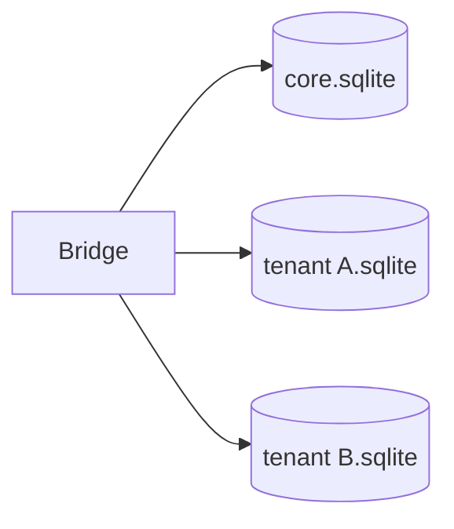
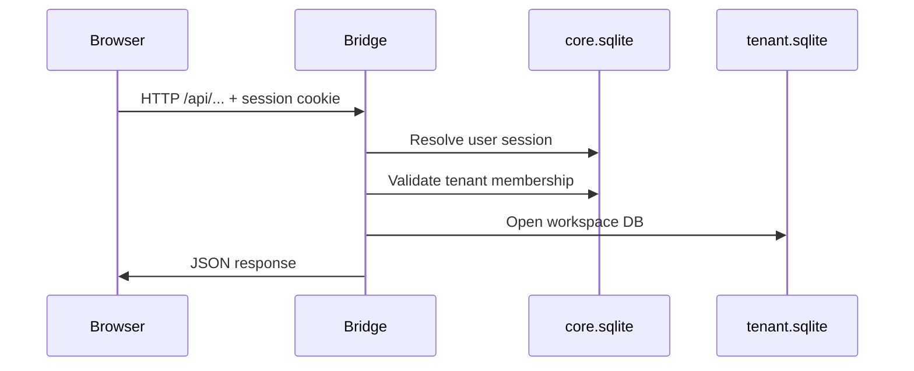
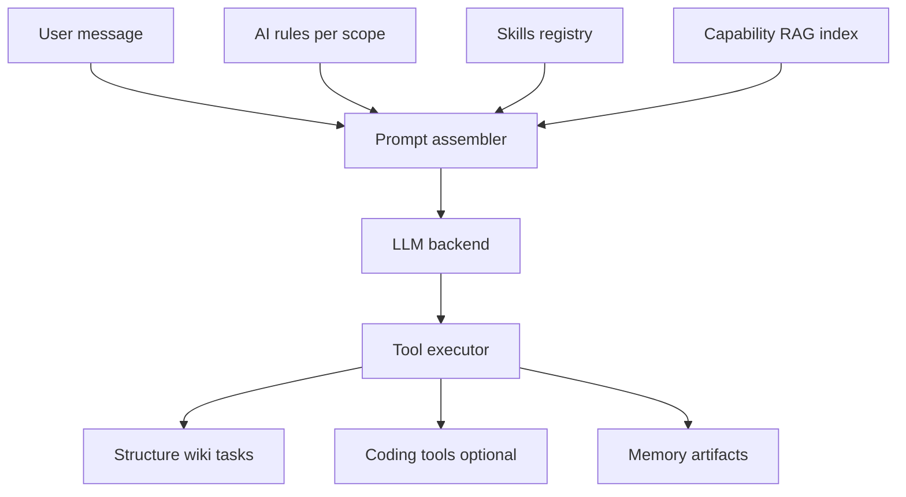

# Architecture

GodMode is a **local-first personal OS**: a React dashboard talks to a Node.js Bridge, which owns SQLite databases and orchestrates Intelligence, structure, agents, and optional plugins.

## Layer overview

| Layer | Technology | Role |
|-------|------------|------|
| Web dashboard | React + Vite | Control plane UI — Intelligence, structure, wiki, tasks |
| Bridge | Node.js + Express + SQLite | REST/WebSocket API, auth, tenant routing, AI orchestration |
| Connector | Node.js (optional) | Local runtime for hardware-bound marketplace plugins |
| Plugins | npm packages / marketplace installs | Domain extensions registered at Bridge and Web boot |

## Data storage

### Core database (`core.sqlite`)

Global platform state:

- **Users and sessions** — email/password auth, session cookies
- **Tenants and memberships** — workspaces and roles
- **Marketplace and credits** — listings, entitlements, wallets (**hub-only** Stripe billing)
- **Share grants** — cross-tenant resource sharing
- **Bridge connections** — federation between Bridge instances

### Per-tenant database (`tenants/<id>.sqlite`)

One SQLite file per workspace:

- **Structure** — departments, divisions, pages
- **Intelligence** — agents, chats, messages, memories, artifacts, rules, skills
- **Productivity** — wiki, kanban cards, calendar, vault secrets
- **Automations** — workflows, hooks, schedules

Physical file separation provides tenant isolation; most tenant tables omit a redundant `tenant_id` column.

## Request flow

Every authenticated request carries `{ userId, tenantId, role }`. Handlers use `getReqTenantDb(req)` — never a global operator database for tenant-scoped data.

WebSocket clients pass `?tenantId=` because browsers cannot set custom headers on the upgrade.

## Intelligence pipeline

Intelligence assembles context from structure scope, rules, skills, and retrieved capabilities, then calls an LLM backend (local llama.cpp or cloud provider via Vault API keys). Tool calls mutate tenant state through a confirm/auto policy.

## Agent model

| Concept | Description |
|---------|-------------|
| **Intelligence** | Top-level agent — platform-wide tools and orchestration |
| **Department agents** | Scoped to a department in the structure tree |
| **Page agents** | Scoped to a single page — narrowest tool allowlist |
| **Digital user** | Mirror of the human user — profile-aware prompts |

Agents can be **owned** (live in your tenant) or **shared** (engine in owner tenant, work in actor tenant).

## Plugin system

Plugins ship a manifest (`godmode.plugin.json`) and register:

- Bridge routes and tools
- Web UI bundles (loaded from `/api/plugins/:id/web.js`)
- Optional migrations and seed data

Discovery order:

1. `GODMODE_PLUGIN_PATH` env var
2. Marketplace-installed paths in `platform_meta.marketplace.plugin_paths`
3. Per-tenant `tenant_plugins` (Settings → Plugins)

See [PLUGIN_AUTHORING.md](PLUGIN_AUTHORING.md).

## Deployment modes

| Mode | `DEPLOYMENT_MODE` | Use case |
|------|-------------------|----------|
| Local | `local` (default) | Personal workstation |
| Hub | `hub` | Multi-tenant SaaS (invite/password auth) |
| Client | `client` | Personal Docker; marketplace via `CLOUD_HUB_URL` |

See [DEPLOY.md](../DEPLOY.md) for Docker compose layouts.

## Security boundaries

- **Auth:** email/password + HttpOnly session cookies (no OAuth in OSS core)
- **Agents with code access** can run terminal and file tools — treat as trusted operators
- **Plugins** run with Bridge host privileges — install only from trusted sources
- **Production:** set `AUTH_ALLOW_ANONYMOUS=false`, strong `AUTH_SESSION_SECRET`, invite codes on public hubs

See [SECURITY.md](SECURITY.md).
